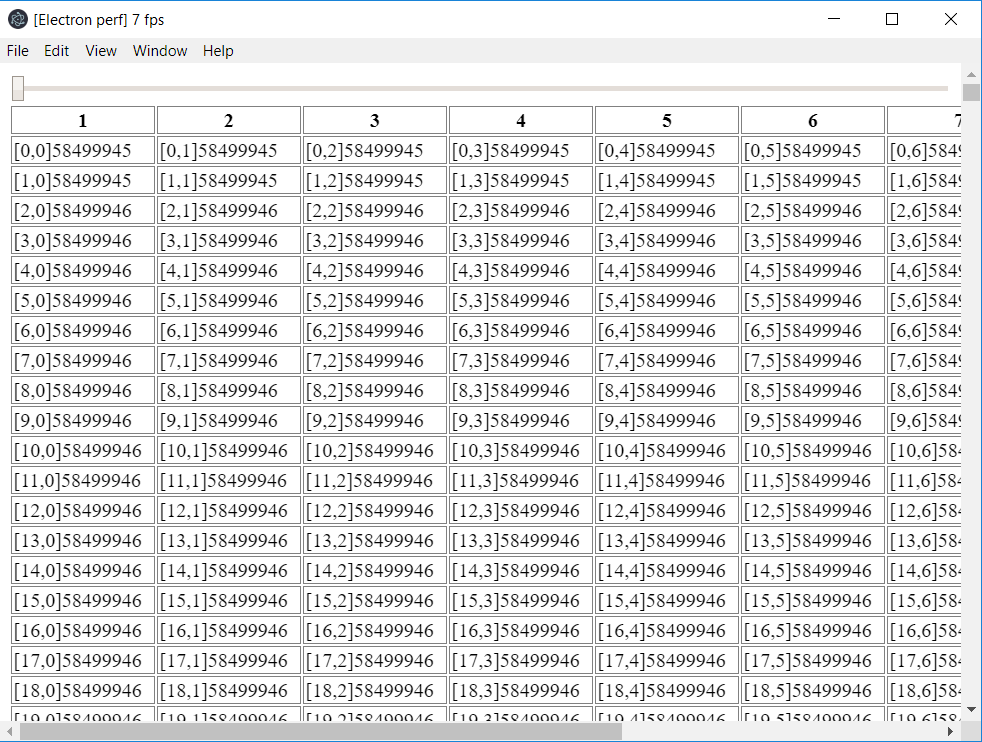
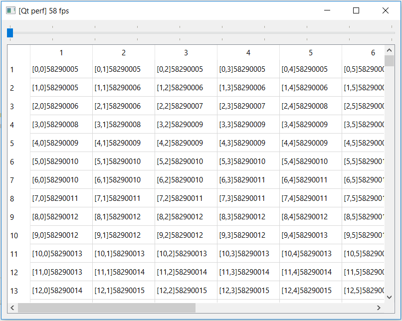

# qt-perf

__Electron__ vs __Qt__ perf. comparison.

This is __Qt__ part.

## Install & Run

1. [Install QT](https://www.qt.io/download)
2. Open project __qt-perf.pro__
3. Run
4. FPS should be printed in window title

## Results

In case of huge DOM __Qt__ ~10 times better than __Electron__.

